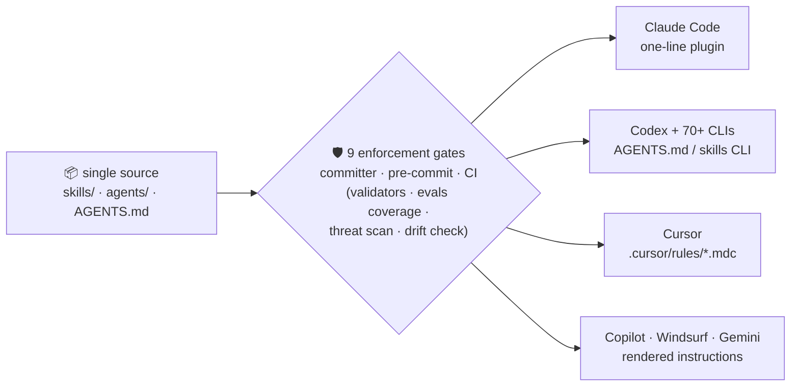

<div align="center">

# Agents-Scripts

**Curated, CI-enforced skills & subagents for AI coding agents.**
One-line install · zero dependencies · every claim enforced, not asserted.

[](https://github.com/ayaqen/Agents-Scripts/actions/workflows/ci.yml)
[](https://github.com/ayaqen/Agents-Scripts/releases)
[](LICENSE)
[](https://github.com/ayaqen/Agents-Scripts/stargazers)


<a href="#-install-in-10-seconds">Install</a> •
<a href="#-why-curated-beats-big">Why</a> •
<a href="#-how-it-works">How it works</a> •
<a href="#-whats-inside">What's inside</a> •
<a href="#-docs">Docs</a> •
<a href="#-contributing">Contributing</a>

</div>

---

## ⚡ Install in 10 seconds

```text
/plugin marketplace add ayaqen/Agents-Scripts
/plugin install agents-scripts@agents-scripts
```

Every skill doubles as a `/slash-command` in Claude Code. One source, every major harness:

| Harness | Path | Status |
|---|---|:---:|
| Claude Code | plugin marketplace (above) | ✅ native |
| Codex | `AGENTS.md` + `./scripts/sync-skills` | ✅ native |
| 70+ agent CLIs | `npx skills add ayaqen/Agents-Scripts` | ✅ compatible |
| Cursor | `.cursor/rules/` (pre-rendered) | ✅ generated |
| GitHub Copilot | `.github/copilot-instructions.md` | ✅ generated |
| Windsurf | `.windsurfrules` | ✅ generated |
| Gemini CLI | `GEMINI.md` | ✅ generated |

Generated targets come from the same source as the skills and are drift-checked in CI — they cannot rot.

## 🎯 Why curated beats big

The agent-skills ecosystem has an inversion problem: distribution scaled, quality didn't. Zero-curation registries list hundreds of thousands of skills with no vetting; a community audit found roughly three quarters of sampled community skills scoring below 60/100 — most failing *silently*; and security researchers have demonstrated real prompt-injection attacks delivered through third-party skills and hooks. Meanwhile every installed skill's metadata occupies context on every turn, so bloated catalogs literally cost tokens. (Sources and methodology: [docs/evaluation.md](docs/evaluation.md).)

This repo takes the opposite bet — **a small catalog where every claim is enforced by CI, not asserted by a README**:

| Guarantee | How it's enforced |
|---|---|
| One-line install | Claude Code plugin packaging, checked by `validate-plugin` in CI |
| Spec-level validation | Front-matter allow-lists, enforced body structure, dead-link checks, shellcheck, 80 self-tests — on Ubuntu **and** macOS |
| Measured effectiveness | Every skill ships graded eval scenarios ([docs/evals.md](docs/evals.md)); results tracked in-repo as the regression baseline |
| Static security properties | Every PR runs a static threat scanner ([SECURITY.md](SECURITY.md)): unicode smuggling, exec-pipe and obfuscation patterns, agent-steering phrases, credential probes; dynamic shell preprocessing validator-banned; front-matter keys allow-listed; "helpers make no network calls" is scanner-enforced; zero dependencies |
| Token discipline | Routing descriptions hard-capped at 200 chars, bodies at 120 lines; a deliberately small catalog instead of a firehose |
| Portability | One source, every major harness — `render-rules --check` in CI blocks drift; bash 3.2 + python3 stdlib only |
| Trigger observability | `explain-routing` shows which skill a task phrase routes to and why — with an `--overlap` audit for competing descriptions |

## 🔬 How it works



The same validators run at three points, strictest-last: `committer` → pre-commit hook → CI on both OSes. A file that doesn't parse, a link that doesn't resolve, a rendered rule that drifted, or a threat-pattern match cannot merge.

## 🧰 What's inside

**17 workflow skills** — transferable engineering practice, not personal tool wrappers. Each is model-invocable *and* a slash command:

| Skill | Use it when |
|---|---|
| [repo-onboarding](skills/repo-onboarding/SKILL.md) | Mapping an unfamiliar codebase before changing it |
| [debug-loop](skills/debug-loop/SKILL.md) | Hypothesis-driven debugging of failing code or tests |
| [regression-fix](skills/regression-fix/SKILL.md) | Fixing a bug with a failing test written first |
| [safe-refactor](skills/safe-refactor/SKILL.md) | Behavior-preserving refactors, verified at each step |
| [self-review](skills/self-review/SKILL.md) | Reviewing your own diff before committing |
| [pr-review](skills/pr-review/SKILL.md) | Reviewing someone else's pull request before merge |
| [security-review](skills/security-review/SKILL.md) | Security pass over a diff, feature, or dependency |
| [ci-green](skills/ci-green/SKILL.md) | Driving a failing CI pipeline back to green |
| [release-checklist](skills/release-checklist/SKILL.md) | Cutting and *verifying* a release |
| [dependency-vet](skills/dependency-vet/SKILL.md) | Evaluating a dependency before adding it |
| [session-handoff](skills/session-handoff/SKILL.md) | Writing a handoff so the next session can continue |
| [context-budget](skills/context-budget/SKILL.md) | Working in large codebases without drowning context |
| [model-tiering](skills/model-tiering/SKILL.md) | Frontier-model orchestration with cheaper executor subagents |
| [prompt-triage](skills/prompt-triage/SKILL.md) | Debugging LLM prompt / agent misbehavior |
| [eval-design](skills/eval-design/SKILL.md) | Designing evals for an LLM-powered feature |
| [tool-design](skills/tool-design/SKILL.md) | Designing tools and MCP servers agents use correctly |
| [skill-author](skills/skill-author/SKILL.md) | Creating or updating skills in this repo |

**5 tiered subagents** — the model-tiering pattern, shipped as installable agents. Every agent body ends with a validator-enforced `## Output contract`, because an orchestrator only ever sees the final report:

| Agent | Tier | Role |
|---|---|---|
| [code-reviewer](agents/code-reviewer.md) | sonnet | Read-only diff review; blocking/non-blocking findings with file:line anchors |
| [security-auditor](agents/security-auditor.md) | inherit | Traces untrusted input to sinks; confirms exploitability before reporting |
| [bug-hunter](agents/bug-hunter.md) | inherit | Reproduces and root-causes; returns proven cause plus dead-hypothesis list |
| [test-writer](agents/test-writer.md) | sonnet | Failing-first regression tests matching your suite's conventions |
| [mechanical-editor](agents/mechanical-editor.md) | haiku | Executes exact-spec edits; stops and reports on any spec mismatch |

## 🚀 Quickstart (manual path)

```bash
git clone https://github.com/ayaqen/Agents-Scripts.git
cd Agents-Scripts
./scripts/doctor                  # environment + repo health check
./scripts/sync-skills             # link skills into ~/.claude/skills and ~/.codex/skills
git config core.hooksPath hooks   # optional: block commits that break validation
```

Create a new skill (scaffolded, validated, safe with any description text):

```bash
./scripts/new-skill my-workflow "Short trigger phrase for routing."
```

Wondering why a skill isn't triggering?

```bash
./scripts/explain-routing "my test is failing intermittently"
```

<details>
<summary><b>🗂 Repository layout</b></summary>

```
AGENTS.md            Shared hard rules for every agent session
CLAUDE.md            Pointer file for harnesses that only read CLAUDE.md
skills/<name>/       One skill per directory: SKILL.md + optional scripts/
agents/              Subagent definitions with enforced output contracts
evals/               Per-skill semantic eval scenarios + tracked results
.claude-plugin/      Plugin + marketplace manifests (one-line install)
.cursor/ GEMINI.md   Rendered rules for Cursor/Copilot/Windsurf/Gemini
                     (generated by render-rules; drift-checked in CI)
scripts/             validate-* gates, scan-security, render-rules,
                     eval-skills, explain-routing, new-skill,
                     sync-skills, committer, doctor
templates/skill/     Scaffold used by new-skill
hooks/               pre-commit guardrail
docs/                Architecture, authoring guide, install, evaluation,
                     design decisions
tests/               Fixture-based self-tests for all tooling (run in CI)
```

</details>

## 📐 Design principles

1. **Portable or it doesn't ship.** No personal paths, no symlinks into sibling repos, no macOS-only assumptions.
2. **One toolchain.** bash (3.2-compatible) + python3 stdlib. Nothing to install before the guardrails run.
3. **Validation is enforced, not suggested.** The same validators run in `committer`, the pre-commit hook, and CI — a file that doesn't parse cannot merge.
4. **Curated beats big.** Fewer, broader skills route better than many narrow ones, and cost less context. Extend an existing skill before adding a neighbor.
5. **Front matter is deliberately dumb.** Simple `key: "value"` lines, allow-listed keys. Universally parseable, and structurally incapable of smuggling hook/shell configuration.
6. **Local beats global.** Machine-specific rules live in untracked `AGENTS.local.md`, never in shared files.

## ✅ CI

Every push and PR runs on both Ubuntu and macOS: `bash -n` + shellcheck on all shell scripts, six validators (skills, docs, agents, plugin, evals, links), the rendered-rules drift check, the static threat scanner as its own job, and the 80-case tooling self-test suite. The workflow runs with read-only permissions and its actions are Dependabot-updated. See [.github/workflows/ci.yml](.github/workflows/ci.yml).

## 📚 Docs

- [Evaluation: the landscape, demand signals, and roadmap](docs/evaluation.md)
- [Semantic evals: schema, runner, no-regression policy](docs/evals.md)
- [Architecture and enforcement chain](docs/architecture.md)
- [Installation (all paths)](docs/installation.md)
- [Skill authoring contract](docs/skill-authoring.md)
- [Design decisions vs. the original agent-scripts](docs/design-decisions.md)

## 🤝 Contributing

See [CONTRIBUTING.md](CONTRIBUTING.md). The bar: portable content, validated structure, matching eval scenarios, and real earned knowledge in every Pitfalls section.

## 📄 License

[MIT](LICENSE)

---

<div align="center">

**If this repo saves you a debugging afternoon, a ⭐ helps others find it.**

[](https://github.com/ayaqen/Agents-Scripts/stargazers)

</div>
